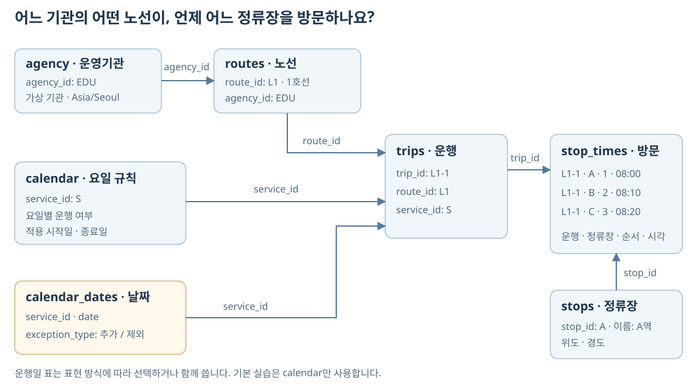
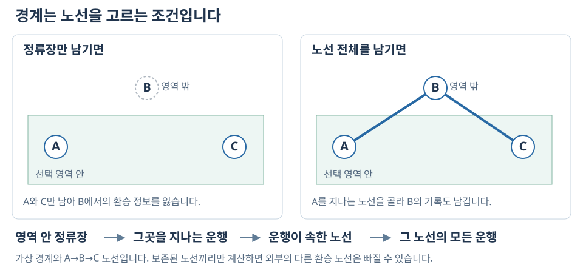
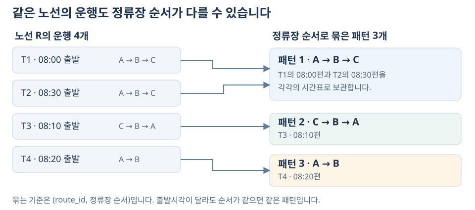

---
jupytext:
  formats: md:myst
  text_representation:
    extension: .md
    format_name: myst
    format_version: 0.13
    jupytext_version: 1.16.4
kernelspec:
  display_name: Python 3
  language: python
  name: python3
---

# 5장 GTFS의 데이터 구조와 시간표 구축

**GTFS**(General Transit Feed Specification)는 대중교통 정보를 주고받는 공개 데이터 표준입니다. 운영기관, 정류장 위치, 노선, 운행 시간표, 운행 날짜를 정해진 파일과 컬럼으로 표현합니다. 교통기관은 이 형식으로 데이터를 제공하고, 지도 서비스, 길찾기 서비스 등에서 광범위하게 활용됩니다. [GTFS 공식 개요][gtfs-overview]

Google 지도는 GTFS로 제공된 시간표와 위치 정보를 대중교통 안내에 사용합니다. 같은 형식의 자료를 다른 경로 안내 앱이나 연구 코드에서도 읽을 수 있습니다. 이 교재도 GTFS를 입력으로 받아 승객이 탈 수 있는 차와 환승 경로를 계산합니다. 노선과 스케줄이 있는 교통시스템(버스, 지하철, 트램, UAM, 수상택시 등)은 모두 GTFS로 데이터를 구축할 수 있습니다. [Google의 GTFS 안내][google-gtfs]

이 장에서는 GTFS의 활용 목적과 주요 파일의 구성을 살펴봅니다. 간단한 예제를 통해 각 표에 어떤 정보가 담기는지, 공통 식별자로 표들을 어떻게 연결하는지 알아봅니다. 이어서 {download}`5장 실습 노트북 <../labs/ch05_gtfs.ipynb>`에서 정류장 세 곳을 지나는 노선의 시간표를 직접 작성합니다.

## 학습 목표

- GTFS의 활용 목적과 주요 파일의 역할을 설명할 수 있다.
- 노선, 개별 운행, 정류장 방문의 관계를 설명할 수 있다.
- `trip_id`와 `stop_id`를 이용해 운행별 정류장과 도착·출발시각을 연결할 수 있다.
- 운행일과 출발시각을 확인하고, 정류장에 도착한 시각을 기준으로 대기시간을 계산할 수 있다.
- GTFS 데이터로 정류장별 시간표를 구성하고, 주어진 시각에 탑승할 수 있는 운행과 목적지 도착시각을 찾을 수 있다.

## 5.1 GTFS 표준과 파일 구성

### 대중교통 데이터의 표준화

교통기관마다 정류장 번호·노선명·시간표를 다른 컬럼 이름으로 제공하면 자료를 받을 때마다 읽는 방식을 바꿔야 합니다. GTFS는 파일명, 컬럼명, 값의 뜻과 표를 연결하는 규칙을 함께 정합니다. 아래 그림처럼 정보를 만드는 쪽과 사용하는 쪽이 이 약속을 공유합니다.


교통기관은 정류장과 운행 시간표를 GTFS 형식으로 제공하고, 지도 서비스와 분석 프로그램은 이 데이터를 활용합니다. 이 교재에서는 GTFS 데이터를 읽어 대중교통 경로를 탐색합니다.

예를 들어 정류장 좌표는 `stops.txt`의 `stop_lat`, `stop_lon`에 들어갑니다. `stop_times.txt`는 정류장 방문 시각을 담습니다. 경로 탐색 프로그램은 이 정보로 어떤 차를 탈지 계산합니다. GTFS 파일이 경로를 계산하는 알고리즘 자체를 담는 것은 아닙니다.

### 예정 시간표와 실시간 운행 정보

| 구분 | 담는 정보 | 예 |
|---|---|---|
| GTFS Schedule | 예정된 정류장·노선·시간표·운행일 | A에서 08:00 출발하는 운행 |
| GTFS Realtime | 운행 갱신·차량 위치·서비스 알림 | 해당 운행의 지연이나 운행 취소 |

이 장과 6장은 **GTFS Schedule**을 사용합니다. 시간표에 08:00이 적혀 있다는 것은 예정된 출발시각이라는 뜻입니다. 실제로 08:00에 출발했다는 관측 기록은 아닙니다. 두 규격의 범위는 [공식 개요][gtfs-overview]에서 구분합니다.

### GTFS 피드의 파일 구성

GTFS Schedule의 기본 표는 CSV 내용의 `.txt` 파일이며, 함께 ZIP으로 묶어 제공합니다. 이런 데이터 묶음을 **피드**(feed)라고 부릅니다. 첫 줄은 컬럼 이름이고 다음 줄부터 각 데이터 행입니다. [Google의 피드 설명][google-gtfs]

아래 표는 시간표를 이해할 때 먼저 확인할 파일들입니다. 각 행의 뜻과 대표 컬럼은 [GTFS 기본 구성 안내][gtfs-base]를 따릅니다.

| 파일 | 어떤 정보를 담나요? | 대표 컬럼 |
|---|---|---|
| `agency.txt` | 서비스를 운영하는 기관의 이름·웹사이트·시간대 | `agency_id`, `agency_name`, `agency_url`, `agency_timezone` |
| `stops.txt` | 정류장·역의 식별자, 이름, 위치 | `stop_id`, `stop_name`, `stop_lat`, `stop_lon` |
| `routes.txt` | 이용자에게 안내하는 노선의 이름과 교통수단 | `route_id`, `agency_id`, `route_short_name`, `route_type` |
| `trips.txt` | 노선에 속한 출발편과 적용 운행일 규칙 | `trip_id`, `route_id`, `service_id` |
| `stop_times.txt` | 각 운행의 정류장 방문 순서와 도착·출발시각 | `trip_id`, `stop_id`, `stop_sequence`, `arrival_time`, `departure_time` |
| `calendar.txt` | 운행하는 요일과 적용 시작일·종료일 | `service_id`, `monday`~`sunday`, `start_date`, `end_date` |
| `calendar_dates.txt` | 특정 날짜의 운행 추가·제외 | `service_id`, `date`, `exception_type` |

파일 일곱 개를 언제나 모두 넣어야 한다는 뜻은 아닙니다. 운행 날짜는 `calendar.txt`의 요일 규칙에 예외를 더하거나, `calendar_dates.txt`에 운행 날짜를 직접 나열할 수 있습니다. 이 실습은 요일·기간 규칙을 쓰고 날짜 예외가 없으므로 `calendar.txt`만 사용합니다. 파일·필드의 필수 조건은 [GTFS 명세][gtfs-reference]를 기준으로 확인합니다.

### 대표 컬럼의 의미와 연결 관계

앞의 파일 표에 나온 대표 컬럼을 식별자, 기본 정보, 시간표와 운행일로 나누어 살펴봅니다. 아래 값은 수업용 예시이며, 필드의 정의는 [GTFS 명세][gtfs-reference]를 따릅니다.

**식별자**는 운영기관·정류장·노선·출발편 등을 구분하고 파일들을 연결하는 값입니다. 같은 정류장을 여러 출발편이 방문해도 `stop_id`는 같습니다.

| 컬럼 | 무엇을 구분하나요? | 파일 간 연결 | 예시 |
|---|---|---|---|
| `agency_id` | 운영기관 | `routes` → `agency` | `EDU`: 가상 운영기관 |
| `stop_id` | 정류장·역 등의 위치 | `stop_times` → `stops` | `A`: A역 |
| `route_id` | 이용자에게 안내하는 노선 | `trips` → `routes` | `L1`: 1호선 |
| `trip_id` | 시간표에 정의된 출발편 | `stop_times` → `trips` | `L1-1`: 08:00 출발편 |
| `service_id` | 운행하는 날짜의 집합 | `trips` → `calendar`·`calendar_dates` | `S`: 예제의 운행일인 2026년 9월 23일 |

화살표는 왼쪽 파일의 식별자로 오른쪽 파일에서 해당 정보를 찾는다는 뜻입니다. 식별자 문자열 자체에 이름이나 시각이 들어 있어야 하는 것은 아닙니다. 예를 들어 `L1-1`의 출발시각은 이 문자열을 해석해서 얻는 것이 아니라 `stop_times.txt`에서 확인합니다.

`route_id`, `trip_id`, `service_id`의 차이를 두 출발편으로 비교해 봅시다.

| 출발편 | `route_id` | `trip_id` | `service_id` |
|---|---|---|---|
| 1호선 08:00 출발편 | `L1` | `L1-1` | `S` |
| 1호선 08:30 출발편 | `L1` | `L1-2` | `S` |

두 편은 같은 노선이므로 `route_id`가 같고, 서로 다른 출발편이므로 `trip_id`가 다릅니다. 운행 날짜는 같으므로 `service_id=S`를 공유합니다. `trip_id`로는 정류장별 시각을, `service_id`로는 운행 날짜를 찾습니다. 평일마다 반복되는 출발편이라면 같은 `trip_id`가 여러 날짜에 적용될 수 있습니다. `trip_id`는 차량 번호도, 특정 날짜의 실제 운행 기록 번호도 아닙니다.

**기본 정보 컬럼**에는 이용자에게 보여 줄 이름과 위치, 교통수단 등을 기록합니다.

| 파일 | 컬럼 | 의미 | 예시 |
|---|---|---|---|
| `agency.txt` | `agency_name` | 운영기관 이름 | `실습교통` |
| `agency.txt` | `agency_url` | 운영기관 웹사이트 주소 | `https://example.org` |
| `agency.txt` | `agency_timezone` | 운행 시각의 기준 시간대 | `Asia/Seoul` |
| `stops.txt` | `stop_name` | 정류장·역 이름 | `A역` |
| `stops.txt` | `stop_lat` | 정류장의 위도 | `37.5000` |
| `stops.txt` | `stop_lon` | 정류장의 경도 | `127.0000` |
| `routes.txt` | `route_short_name` | 짧은 노선명이나 노선 번호 | `1호선` |
| `routes.txt` | `route_type` | 교통수단 코드 | `1`: 지하철, `3`: 버스 |

이름은 화면에 표시할 때, 식별자는 표를 연결할 때 사용합니다. 예를 들어 정류장 이름이 같더라도 위치가 다른 정류장이면 서로 다른 `stop_id`로 구분할 수 있습니다.

**시간표와 운행일 컬럼**은 어느 정류장에 몇 시에 방문하는지, 그 시간표가 어느 날짜에 적용되는지를 나타냅니다.

| 파일 | 컬럼 | 의미 | 예시 |
|---|---|---|---|
| `stop_times.txt` | `stop_sequence` | 한 출발편 안에서 정류장을 방문하는 순서 | `2`: 예제에서 두 번째 방문인 B역 |
| `stop_times.txt` | `arrival_time` | 해당 정류장에 도착하는 시각 | `08:10:00` |
| `stop_times.txt` | `departure_time` | 해당 정류장에서 출발하는 시각 | `08:12:00` |
| `calendar.txt` | `monday`~`sunday` | 적용 기간 중 각 요일의 운행 여부를 나타내는 일곱 컬럼 | `1`: 운행, `0`: 미운행 |
| `calendar.txt` | `start_date` | 적용 시작일, 해당 날짜 포함 | `20260923` |
| `calendar.txt` | `end_date` | 적용 종료일, 해당 날짜 포함 | `20260923` |
| `calendar_dates.txt` | `date` | 운행을 추가하거나 제외할 날짜 | `20260924` |
| `calendar_dates.txt` | `exception_type` | 해당 날짜의 운행 추가·제외 구분 | `1`: 추가, `2`: 제외 |

`stop_sequence`는 파일 전체의 행 번호가 아니라 각 출발편 안의 방문 순서입니다. 값은 방문 순서대로 증가해야 하지만 반드시 1부터 시작하거나 연속할 필요는 없습니다. 날짜는 `YYYYMMDD`, 시각은 `HH:MM:SS`로 기록합니다. 자정 이후까지 이어지는 운행은 `24:20:00`처럼 24시 이상의 시각을 사용할 수 있습니다. 운행일과 날짜 예외, 자정 이후 시각은 5.3절에서 예제로 살펴봅니다.

### 노선 선형·환승·요금 관련 파일

위의 표 외에도 목적에 따라 파일을 추가합니다. 아래는 대표적인 예이며 전체 파일 목록은 [GTFS 명세][gtfs-reference]에 있습니다.

| 파일 | 추가로 담는 정보 | 앞의 표와 구분할 점 |
|---|---|---|
| `shapes.txt` | 차량 이동 경로를 그릴 좌표열 | 정류장 점 목록과 실제 노선 선형은 다릅니다 |
| `transfers.txt` | 환승 규칙과 최소 환승시간 등 | 두 정류장이 가까워도 환승 조건을 확인합니다 |
| `frequencies.txt` | 운행 시간대와 배차간격 | 개별 출발시각을 나열하는 방식과 구분합니다 |
| 요금 관련 파일 | 요금 상품·적용·환승 요금 규칙 | 예: `fare_products.txt`, `fare_leg_rules.txt` |
| `feed_info.txt` | 데이터 발행자·언어·적용 기간 등의 정보 | 운행기관 정보와 데이터 발행 정보를 구분합니다 |

모든 파일을 직접 작성하는 것은 이번 수업의 목표가 아닙니다. 먼저 운영기관·정류장·노선·운행·방문·운행일의 관계를 읽습니다. 하남 실습 로더는 이 중 경로 계산에 쓰는 다섯 표를 읽습니다. 기본 노트북의 작은 표와 통합 과제에서 만들 독립된 GTFS ZIP의 범위를 구분합니다.

## 5.2 GTFS의 관계형 데이터 구조

### 노선·운행·정류장 방문의 구분

A→B→C를 지나는 1호선이 있습니다. 첫 차는 A에서 08:00에 출발해 B에 08:10, C에 08:20 도착합니다. 다음 차는 같은 정류장을 30분 뒤에 방문합니다. 이 예제에서는 정차시간이 0초여서 도착과 출발시각이 같습니다.

| 출발편 | A | B | C |
|---|---|---|---|
| `L1-1` | 08:00 | 08:10 | 08:20 |
| `L1-2` | 08:30 | 08:40 | 08:50 |

한 행을 왼쪽에서 오른쪽으로 읽으면 차 한 편의 이동입니다. A 열을 위에서 아래로 읽으면 A에서 탈 수 있는 출발편 목록입니다. 08:03에 A에 도착한 승객은 첫 행의 차를 놓칩니다. 두 번째 행을 따라가면 C의 도착시각은 08:50입니다.

**노선**(route)은 이용자에게 안내하는 서비스의 묶음입니다. **운행**(trip)은 정해진 시각과 순서로 정류장을 방문하는 출발편 하나입니다. 두 출발편은 `route_id=L1`을 공유하지만 `trip_id`는 서로 다릅니다. `trip_id`는 차량 번호가 아니므로 이 표만으로 차량이 몇 대 필요한지 알 수는 없습니다.

정류장은 A·B·C 세 곳입니다. 첫 편이 세 곳을 방문하고 두 번째 편도 세 곳을 방문하므로 방문 기록은 여섯 개입니다. 같은 정류장을 두 운행이 이용해도 정류장 자체를 두 개로 만들지는 않습니다.

노트북 1절을 열기 전에 08:00과 08:03에 A에 도착한 승객이 각각 어느 행을 읽어야 하는지 골라 봅시다. 정각 탑승을 허용하므로 답은 `L1-1`, `L1-2`입니다. 이를 설명한 뒤 두 출발편을 코드로 조회합니다.

### 식별자와 테이블 간 관계

앞의 표에 정류장 이름과 좌표를 모두 적으면 운행이 늘 때마다 같은 정보를 반복해야 합니다. GTFS는 정류장 정보와 방문 시각을 별도 표에 두고 식별자로 연결합니다. 파일은 쉼표로 컬럼을 구분하는 CSV이며 확장자는 `.txt`입니다.

| 표 | 한 행이 뜻하는 것 | 작은 예제의 행 수 | 연결에 쓰는 컬럼 |
|---|---|---:|---|
| `stops` | 정류장 한 곳의 이름과 좌표 | 3 | `stop_id` |
| `routes` | 노선 하나 | 1 | `route_id` |
| `trips` | 출발편 하나 | 2 | `trip_id`, `route_id`, `service_id` |
| `stop_times` | 한 운행의 정류장 방문 한 번 | 6 | `trip_id`, `stop_id`, `stop_sequence` |
| `calendar` | 운행 날짜의 규칙 하나 | 1 | `service_id` |

`service_id`는 운행 날짜의 규칙을 가리킵니다. 여기서는 두 편 모두 같은 날 운행한다고 정하고 같은 값 `S`를 씁니다. 날짜를 읽는 방법은 5.3절에서 다룹니다. 위 표는 노트북에서 계산에 사용하는 다섯 표입니다. 운영기관 `agency`는 ZIP을 만드는 통합 과제에서 추가합니다.

### TXT 파일의 실제 내용 읽기

앞의 예제를 GTFS 파일로 작성하면 다음과 같습니다. 확장자는 `.txt`이지만 내용은 쉼표로 값을 구분하는 CSV입니다. 첫 줄은 컬럼 이름이고, 이후 한 줄이 데이터 한 행입니다. 아래 여섯 파일은 2026년 9월 23일에 A→B→C를 운행하는 두 출발편을 나타냅니다. 운영기관 이름과 URL, 정류장 좌표는 모두 설명용 가상 값입니다.

아래 내용을 저장한 파일은 `data/examples/gtfs_abc/`에 있습니다. {download}`A→B→C 예제 GTFS ZIP <../data/examples/gtfs_abc.zip>`을 내려받으면 여섯 TXT 파일을 함께 열어 볼 수 있습니다. 개별 파일도 내려받을 수 있습니다: {download}`agency.txt <../data/examples/gtfs_abc/agency.txt>`, {download}`stops.txt <../data/examples/gtfs_abc/stops.txt>`, {download}`routes.txt <../data/examples/gtfs_abc/routes.txt>`, {download}`calendar.txt <../data/examples/gtfs_abc/calendar.txt>`, {download}`trips.txt <../data/examples/gtfs_abc/trips.txt>`, {download}`stop_times.txt <../data/examples/gtfs_abc/stop_times.txt>`.

**`agency.txt` — 운영기관**

```text
agency_id,agency_name,agency_url,agency_timezone
EDU,실습교통,https://example.org,Asia/Seoul
```

`EDU`라는 식별자로 운영기관을 등록합니다. 이름은 ‘실습교통’이며, 시간표는 `Asia/Seoul` 시간대를 기준으로 읽습니다.

**`stops.txt` — 정류장 이름과 위치**

```text
stop_id,stop_name,stop_lat,stop_lon
A,A역,37.5000,127.0000
B,B역,37.5100,127.0100
C,C역,37.5200,127.0200
```

한 행이 정류장 한 곳입니다. `A`는 다른 파일에서 A역을 가리킬 때 사용하는 값입니다. 두 출발편이 모두 A역에 정차해도 이 파일에는 A역을 한 번만 기록합니다.

**`routes.txt` — 노선**

```text
route_id,agency_id,route_short_name,route_type
L1,EDU,1호선,1
```

`L1`은 ‘1호선’의 식별자입니다. `agency_id=EDU`를 따라가면 운영기관이 ‘실습교통’임을 알 수 있습니다. `route_type=1`은 지하철을 뜻합니다. 이 행에는 개별 출발편의 시각을 적지 않습니다.

**`calendar.txt` — 운행 날짜**

```text
service_id,monday,tuesday,wednesday,thursday,friday,saturday,sunday,start_date,end_date
S,1,1,1,1,1,1,1,20260923,20260923
```

`S`는 이 예제의 운행 날짜 조건입니다. 모든 요일 값이 `1`이지만 시작일과 종료일이 모두 `20260923`이므로 2026년 9월 23일에만 적용됩니다. 날짜 범위와 요일 조건을 함께 확인해야 합니다.

**`trips.txt` — 노선별 출발편**

```text
route_id,service_id,trip_id
L1,S,L1-1
L1,S,L1-2
```

첫 행은 ‘노선 `L1`에 속한 출발편 `L1-1`이 날짜 조건 `S`에 따라 운행한다’는 뜻입니다. 두 행의 `route_id`와 `service_id`는 같고 `trip_id`는 다릅니다. 따라서 같은 노선에서 같은 날 운행하는 서로 다른 두 출발편입니다. 출발시각은 다음 파일에서 확인합니다.

**`stop_times.txt` — 출발편별 정류장 방문 시각**

```text
trip_id,arrival_time,departure_time,stop_id,stop_sequence
L1-1,08:00:00,08:00:00,A,1
L1-1,08:10:00,08:10:00,B,2
L1-1,08:20:00,08:20:00,C,3
L1-2,08:30:00,08:30:00,A,1
L1-2,08:40:00,08:40:00,B,2
L1-2,08:50:00,08:50:00,C,3
```

첫 세 행은 `L1-1`, 다음 세 행은 `L1-2`의 시간표입니다. `trip_id=L1-2`이고 `stop_id=B`인 행은 두 번째 출발편이 B역에 08:40에 도착하고 같은 시각에 출발한다는 뜻입니다. 예제에서는 정차시간을 0초로 두었습니다. 정류장 이름은 `stops.txt`, 노선은 `trips.txt`와 `routes.txt`, 운행 날짜는 `trips.txt`와 `calendar.txt`를 연결해 찾습니다.

**`calendar_dates.txt` — 특정 날짜의 운행 추가·제외**

이 파일은 위 여섯 파일로 구성한 기본 예제에 포함하지 않습니다. 두 출발편을 9월 24일에도 운행하려면 다음 파일을 추가할 수 있습니다.

```text
service_id,date,exception_type
S,20260924,1
```

`exception_type=1`이므로 날짜 조건 `S`에 9월 24일을 추가합니다. `S`를 사용하는 `L1-1`과 `L1-2` 모두 그날에도 운행합니다. 두 출발편의 행이나 정류장별 시각을 다시 작성할 필요는 없습니다. 반대로 기본 운행일인 9월 23일의 운행을 취소하려면 `S,20260923,2`라는 행을 사용합니다.

이제 기본 예제에서 ‘9월 23일 08:03에 A역에 도착하면 C역까지 어느 출발편을 탈 수 있는가’를 파일을 따라 확인해 봅시다.

1. `calendar.txt`에서 해당 날짜에 `S`가 적용됨을 확인합니다.
2. `trips.txt`에서 `service_id=S`인 `L1-1`과 `L1-2`를 찾습니다.
3. `stop_times.txt`에서 두 출발편의 A역 출발시각을 비교합니다. 08:00편은 이미 출발했으므로 08:30편인 `L1-2`를 고릅니다.
4. 같은 `trip_id=L1-2`의 C역 방문 행을 읽으면 도착시각은 08:50입니다. 대기시간은 27분입니다.

### 운행 시간표의 조회와 테이블 결합

C의 도착시각을 알고 싶다면 `stop_times`에서 운행을 먼저 고릅니다. `trip_id=L1-1`인 행을 고르면 세 행이 남습니다. 이 행들을 `stop_sequence` 순서로 읽으면 A 08:00, B 08:10, C 08:20입니다.

| `trip_id` | `stop_id` | `stop_sequence` | `arrival_time` | `departure_time` |
|---|---|---:|---|---|
| `L1-1` | A | 1 | 08:00:00 | 08:00:00 |
| `L1-1` | B | 2 | 08:10:00 | 08:10:00 |
| `L1-1` | C | 3 | 08:20:00 | 08:20:00 |
| `L1-2` | A | 1 | 08:30:00 | 08:30:00 |
| `L1-2` | B | 2 | 08:40:00 | 08:40:00 |
| `L1-2` | C | 3 | 08:50:00 | 08:50:00 |

두 번째 편의 순서는 다시 1부터 시작합니다. `stop_sequence`는 각 운행 안의 방문 순서입니다. 파일의 행 번호나 정류장 이름순으로 읽으면 차량이 방문하는 순서를 보장할 수 없습니다.

`stop_times`에는 정류장 이름이 없습니다. `stop_id=B`를 `stops`에서 찾으면 이름 `B역`과 좌표를 얻습니다. 같은 `trip_id`를 `trips`에서 찾으면 `route_id=L1`을 얻고, `routes`에서 그 노선의 이름을 읽습니다. 아래 그림의 화살표를 따라 이 값을 찾아 봅시다.



GTFS 파일의 연결. 운영기관·운행일도 같은 식별자로 이어집니다. 기본 실습에서는 날짜 예외를 생략합니다.

노트북 2절의 `merge`는 같은 식별자를 가진 행 옆에 필요한 컬럼을 붙입니다. 방문 여섯 행에 정류장 이름을 붙이면 여전히 여섯 행이어야 합니다. 정류장 표에 같은 `stop_id`가 두 행 있으면 연결 결과가 늘어날 수 있어, 실습에서는 정류장 식별자가 고유한지도 확인합니다.

`L1-2`의 B 방문 한 행을 설명해 봅시다. 1호선의 두 번째 출발편이 두 번째 정류장인 B역을 08:40에 방문한다는 뜻입니다. 이 문장을 표의 어느 컬럼에서 읽었는지 짚은 뒤 연결 코드를 실행합니다.

## 5.3 운행일과 시각의 표현

### 운행일 규칙과 예외

08:30이라는 시각만으로 오늘 탈 수 있는 차인지 알 수는 없습니다. `trips.service_id`가 가리키는 `calendar`의 적용 기간과 요일을 함께 읽습니다. 기간 안에 있어도 해당 요일이 `0`이면 그 규칙으로는 운행하지 않습니다.

작은 예제의 규칙 `S`는 2026-09-23 하루만 적용합니다. 시작일과 종료일이 모두 `20260923`이며 요일 값은 모두 `1`입니다. 그래서 그날에는 두 편이 운행하지만 다음 날에는 운행하지 않습니다. 요일이 모두 `1`이어도 적용 기간을 넘어설 수는 없습니다.

특정 날짜의 운행 추가·제외는 `calendar_dates`로 표현할 수 있습니다. 예를 들어 `S,20260924,1`은 규칙 `S`의 운행을 9월 24일에도 추가한다는 뜻입니다. 기본 예제에는 이 예외 행을 넣지 않으므로 9월 23일에만 운행합니다. 필드 전체는 [GTFS 명세][gtfs-reference]에서 확인할 수 있습니다.

### 대기시간·차내시간·통행시간

08:03에 A에 도착한 승객은 08:30 차를 탑니다. 대기시간은 `08:30−08:03=27분`입니다. 차내시간은 `08:50−08:30=20분`, 전체 통행시간은 `08:50−08:03=47분`입니다.

| 정류장에 준비된 시각 | 탄 차의 출발 | C 도착 | 대기 | 차내 | 합계 |
|---|---|---|---:|---:|---:|
| 07:58 | 08:00 | 08:20 | 2분 | 20분 | 22분 |
| 08:03 | 08:30 | 08:50 | 27분 | 20분 | 47분 |

도착시각 08:50과 통행시간 47분은 단위가 다른 값입니다. 노트북에서는 시각을 운행일 시작부터 지난 초로 바꿉니다. 두 시각의 차이를 구한 뒤 60으로 나누면 분 단위 시간이 됩니다.

차가 B에 08:10 도착해 08:12에 출발한다면 두 시각도 구분해야 합니다. 하차 가능한 시각은 `arrival_time`, 승차 가능 여부를 판단하는 시각은 `departure_time`입니다. 기본 예제는 정차시간을 0초로 두어 두 값이 같습니다.

### 자정 이후 시각의 표현

23:50 출발, 다음 날 00:20 도착은 30분 통행입니다. GTFS에서는 같은 운행일의 도착을 `24:20:00`으로 적을 수 있습니다. `시×3600+분×60+초`로 바꾸면 출발은 85,800초, 도착은 87,600초입니다. 차이는 1,800초입니다.

노트북의 `parse_gtfs_time`은 24시 이상도 그대로 초로 바꿉니다. `24:20:00`을 `00:20:00`으로 되돌리면 다음 날이라는 정보가 사라집니다. 실제 심야 기록의 분포는 추가 탐색에서 읽습니다.

노트북 3절을 실행하기 전에 `08:30−08:03`과 `24:20−23:50`을 각각 분으로 적어 봅시다. 예상값 27분과 30분을 코드 결과와 대조합니다.

## 5.4 신규 노선의 시간표 구축

이제 `MY`라는 가상 셔틀을 설계합니다. 앞에서 본 A·B·C의 위치를 재사용하고 A→B에 4분, B→C에 6분을 배정합니다. 첫 출발은 08:00, 두 번째 출발은 08:20입니다. 이 시간은 실제 운행 측정값이 아닌 수업용 가정입니다.

먼저 첫 편을 종이에 써 봅시다. A에서 출발한 뒤 4분이 지나 B에, 거기서 6분을 더 가 C에 도착합니다. C의 시각에는 두 구간의 시간을 모두 더합니다.

| 방문 순서 | 정류장 | 앞 구간 시간 | A부터 누적 시간 | 첫 편 `MY-1` | 두 번째 편 `MY-2` |
|---|---|---|---|---|---|
| 1 | A | 출발점 | 0분 | 08:00 | 08:20 |
| 2 | B | 4분 | 4분 | 08:04 | 08:24 |
| 3 | C | 6분 | 10분 | 08:10 | 08:30 |

배차간격 20분은 A에서 두 편이 출발하는 간격입니다. A에서 C까지 걸리는 10분과 구분합니다. 두 편이 같은 구간시간을 사용하므로 B와 C에서도 두 시각의 차이는 20분입니다.

작성 순서는 `routes`의 노선 한 행, `trips`의 출발편 두 행, `stop_times`의 방문 여섯 행입니다. 두 운행은 `route_id=MY`를 공유하고 `trip_id`는 `MY-1`, `MY-2`로 나눕니다. 기존 `stops`와 운행일 규칙 `S`는 그대로 사용할 수 있습니다.

노트북 4절은 첫 편의 세 행을 제공합니다. 두 번째 편의 세 행을 작성한 뒤 식별자·방문 순서·시각을 대조합니다. 첫 편을 한 번 읽고 두 번째 편을 직접 쓰면서 표 한 행의 뜻을 확인합니다. 정차시간은 계속 0초로 둡니다.

방문 시각을 확인할 때는 두 번 읽습니다. 운행별로 읽으면 A→B→C 순서이며 시간이 뒤로 가지 않아야 합니다. 정류장별로 읽으면 첫 편과 다음 편의 차이가 20분이어야 합니다. 여섯 행이 있다는 사실만으로 시각까지 맞는 것은 아닙니다.

기본 실습의 산출물은 새 시간표 여섯 행과 설계 이유 두 문장입니다. 독립된 GTFS ZIP에는 운영기관의 `agency.txt`도 필요합니다. 이 표의 추가와 파일 저장은 5.8절의 통합 과제에서 진행합니다.

## 5.5 탑승 가능 운행과 도착시각 계산

새 셔틀의 A 출발은 08:00과 08:20입니다. 승객이 A에 08:03부터 준비되어 있다면 어느 차를 타고 C에 언제 도착할까요? 첫 차는 이미 떠났습니다. 08:20 차의 행을 따라가면 C 도착은 08:30입니다. 대기 17분과 차내 10분을 합하면 27분입니다.

| A에 준비된 시각 | 탈 차 | C 도착 | 확인할 이유 |
|---|---|---|---|
| 08:00 | `MY-1` | 08:10 | 출발 정각에도 탑승 허용 |
| 08:03 | `MY-2` | 08:30 | 떠난 첫 차는 제외 |
| 08:21 | 없음 | 미도달 | 입력 시간표의 두 편 모두 출발 |

미도달은 입력한 시간표 안에서 탈 차가 없다는 뜻입니다. 통행시간을 0분으로 적으면 가장 빠른 경로처럼 보이므로 빈값으로 남깁니다. 이 예제에는 셔틀 두 편만 있어 다른 버스나 도보로 가는 대안은 계산하지 않습니다.

두 번째 편을 08:10으로 옮기면 B는 08:14, C는 08:20입니다. A의 시각만 고치고 B·C를 그대로 두면 구간시간도 바뀝니다. 노트북에서는 도착시각을 먼저 예상한 뒤, 출발편의 세 방문 시각을 함께 고쳐 봅니다.

여기서는 A에서 탄 한 편을 C까지 따라갔습니다. 6장에서는 중간에 내려 걷고 다른 노선으로 갈아타는 경우를 추가합니다. 다음 장으로 넘어가기 전에 노선·운행·방문의 차이와 대기 17분의 계산을 자기 말로 설명해 봅시다.

## 5.6 하남 GTFS 데이터의 조회와 공간 선택

{download}`추가 탐색 노트북 <../labs/extensions/ch05_gtfs_exploration.ipynb>`을 엽니다. 이 노트북은 필요한 자료를 처음부터 읽으므로 기본 실습의 실행 상태가 필요하지 않습니다. 여기서는 이미 배운 표 관계를 더 큰 자료에서 확인합니다.

### 데이터 규모와 교통수단 코드

하남 자료에는 정류장 4,203개, 노선 169개, 운행 8,923개, 방문 기록 656,385개가 있습니다. 다섯 표는 읽는 시간을 줄이려고 parquet로 저장되어 있습니다. 방문 행 수가 많아져도 한 행의 뜻은 5.2절과 같습니다.

`routes.route_type`은 교통수단 코드입니다. 하남 파일의 코드 `0`은 실습 코드표에서 시내·농어촌·마을버스이며 132개 노선입니다. GTFS 명세의 `0`은 트램이고 버스는 `3`이므로 자료를 섞기 전에 코드표를 확인합니다. `KOREAN_ROUTE_TYPE`은 이 교재의 실습 파일을 해석하는 표입니다.

### 정류장 식별과 운행 조회

이름에 ‘하남시청’이 들어 있는 정류장은 11곳입니다. ‘하남시청소년수련관’도 포함되므로 좌표와 이름을 함께 읽습니다. 예제는 `BS_TAGO_GGB227000034` 한 곳을 선택합니다. 이름이 같은 도로 반대편 정류장과 구분합니다.

이 정류장의 방문 기록에서 08:03 이후 출발을 고르고 `trips`, `routes`를 연결합니다. 다음 차의 목록을 얻어도 목적지로 가는 차인지는 별도입니다. 그 운행의 이후 방문 순서를 읽어 확인합니다.

### 공간 범위에 따른 노선 선택

하남 실습 자료의 정류장 지도를 그리면 시 경계 밖에도 점이 있습니다. 지역을 지나는 노선은 다른 시까지 이어질 수 있기 때문입니다. 파일 이름이 하남이라고 해서 모든 정류장이 하남 안에 있는 것은 아닙니다.

A와 C는 경계 안에 있고 B는 밖에 있는 A→B→C 노선을 생각해 봅시다. B의 기록을 지우면 원래 경유한 정류장과 그곳의 환승 가능성을 잃습니다. C까지의 시간표가 남더라도 전체 경로를 설명할 수 없습니다.

아래 그림에서 두 선택의 차이를 봅시다. 오른쪽은 A를 지나는 노선을 선택했으므로 경계 밖의 B도 남깁니다.



지역 선택의 두 기준. 경계 안 정류장에서 출발해 운행과 노선을 찾은 뒤, 선택된 노선의 모든 방문 기록을 보존합니다.

`clip_to_boundary`는 경계 안의 정류장을 지나는 운행을 찾고, 그 운행이 속한 노선을 선택합니다. 그런 다음 선택된 노선의 운행과 정류장 방문 기록을 모두 남깁니다. 경계는 노선을 고르는 조건으로 쓰입니다.

추가 탐색 노트북에서 실행하면 정류장은 4,203개에서 4,128개로, 노선은 169개에서 167개로 줄어듭니다. `buffer_m=500`은 경계 바깥 500m까지 선택 영역을 넓힙니다. 도보 환승을 500m까지 허용한다는 뜻은 아닙니다.

이 선택만으로 모든 경로가 보존되지는 않습니다. 선택 영역에 들어오지 않는 다른 노선으로 경계 밖에서 환승하는 경로는 빠질 수 있습니다. 목적지가 지역 밖에 있거나 경계 부근의 환승을 분석한다면, 더 넓게 선택한 자료와 결과를 비교합니다.

## 5.7 같은 정류장 순서로 운행하는 출발편 묶기

앞에서 만든 `L1-1`은 08:00에, `L1-2`는 08:30에 출발합니다. 출발시각은 다르지만 두 편 모두 A→B→C 순서로 정류장을 방문합니다. 따라서 두 편의 시간표는 다음처럼 같은 정류장 열을 사용해 나란히 놓을 수 있습니다.

| 출발편 | A | B | C |
|---|---|---|---|
| `L1-1` | 08:00 | 08:10 | 08:20 |
| `L1-2` | 08:30 | 08:40 | 08:50 |

이 책에서는 **같은 노선에서 정류장 방문 순서가 같은 출발편들의 묶음**을 **운행 패턴**이라고 부릅니다. 위 두 편은 하나의 패턴에 속합니다. 패턴으로 묶어도 출발편 두 개와 각각의 시간표는 그대로 유지합니다.

그렇다면 같은 노선의 출발편은 모두 한 패턴으로 묶을 수 있을까요? 반대 방향으로 가거나 일부 구간에서 운행을 마치는 출발편이 있다면 나누어야 합니다. 아래는 이를 설명하기 위한 별도의 가상 노선 `R`입니다. 앞에서 저장한 A→B→C 예제 TXT 파일에 추가된 운행은 아닙니다.

| 출발편 | 출발시각 | 정류장 방문 순서 | 묶음 |
|---|---|---|---|
| `T1` | 08:00 | A → B → C | 패턴 1 |
| `T2` | 08:30 | A → B → C | 패턴 1 |
| `T3` | 08:10 | C → B → A | 패턴 2 |
| `T4` | 08:20 | A → B | 패턴 3 |

`T1`과 `T2`는 출발시각만 다르므로 함께 묶습니다. `T3`는 같은 세 정류장을 방문해도 순서가 반대이므로 따로 묶습니다. `T4`는 C까지 가지 않으므로 또 다른 묶음입니다. 이렇게 노선 하나에 출발편 네 개, 패턴 세 개가 생깁니다.



같은 노선의 네 출발편을 정류장 방문 순서에 따라 세 패턴으로 나눕니다. T1과 T2는 같은 패턴에 속하지만 각각의 시간표를 유지합니다.

이 구분은 승객이 어디까지 갈 수 있는지 판단할 때 필요합니다. B에서 탑승하면 패턴 1의 차는 C로 가지만, 패턴 2의 차는 A로 갑니다. 패턴 3의 차는 B에서 운행을 마칩니다. 노선이 같다는 이유만으로 모두 B 다음에 C로 간다고 처리하면 잘못된 경로가 만들어집니다.

GTFS 파일에서 패턴을 만드는 순서는 다음과 같습니다.

1. `stop_times.txt`에서 같은 `trip_id`의 행을 모읍니다.
2. `stop_sequence` 순서대로 정렬한 뒤 `stop_id`를 읽습니다. 예를 들어 `L1-1`에서는 A→B→C를 얻습니다.
3. `trips.txt`에서 각 출발편의 `route_id`를 확인합니다.
4. 노선과 정류장 방문 순서가 모두 같은 출발편을 하나의 패턴으로 묶습니다. 출발·도착시각은 각 출발편의 값으로 남겨 둡니다.

패턴은 여기서 GTFS 데이터를 읽은 뒤 경로 탐색을 위해 만드는 묶음입니다. 예제 TXT 파일에 별도의 패턴 파일이나 `pattern_id`를 추가할 필요는 없습니다. 다음 장의 RAPTOR 구현은 패턴마다 정류장을 방문 순서대로 살펴보면서 승객이 탈 수 있는 출발편과 도착시각을 찾습니다.

하남 추가 탐색 예제에서도 같은 방법을 사용합니다. 노선 169개에 속한 운행 8,923개를 정류장 방문 순서로 나누면 패턴 349개가 됩니다. 패턴이 노선보다 많은 것은 일부 노선에 방문 순서가 다른 운행이 있기 때문입니다. 구체적으로 반대 방향 운행인지, 일부 구간 운행인지는 해당 출발편의 정류장 목록을 확인해야 합니다.

## 5.8 통합 과제: 신규 노선 설계와 GTFS 생성

6장에서 환승 경로를 이해한 뒤 통합 과제를 진행합니다.
{download}`과제 노트북 <../projects/gtfs_route_design/route_design.ipynb>`을 엽니다. 정류장 선택·구간시간·배차간격을 정하고 GTFS ZIP을 만듭니다. 저장한 파일을 다시 읽은 뒤 기존 하남 시간표에 추가해 출발시각별 효과를 비교합니다.

통합 과제에서는 `agency.txt`를 더해 여섯 TXT 파일을 만듭니다. 운영기관과 신규 노선은 가상이며, 새 ZIP의 버스 코드는 표준의 `3`을 사용합니다. 기존 하남 자료와 합칠 때만 코드 체계를 맞춥니다.

[신규 노선 설계 화면](../_static/ch05_gtfs.html#builder)에는 배경지도와 실습 도로망이 함께 나옵니다. 기존 정류장을 고르거나 도로 위에 새 정류장을 만들고, 생성한 TXT 원문을 확인합니다. 노트북에서는 여섯 방문 행을 직접 작성합니다. 화면의 기본안과 통합 과제의 기본안은 별도 예제이므로 각자의 출발 범위와 정차시간을 먼저 읽습니다.

## 이 장의 실습

{download}`5장 실습 노트북 <../labs/ch05_gtfs.ipynb>`은 다음 다섯 단계로 끝납니다. 각 절의 예상 질문에 먼저 답하고 실행 결과를 대조합니다.

| 순서 | 실행 전에 설명할 것 | 확인할 결과 |
|---|---|---|
| 1 | 노선·운행·방문은 각각 몇 개인가요? | 노선 1개, 운행 2편, 방문 6행 |
| 2 | 방문 시각에 정류장 이름을 어떻게 붙이나요? | 식별자로 연결한 시간표 |
| 3 | 08:03부터 08:30까지 얼마나 기다리나요? | 대기 27분과 운행일 기준 초 |
| 4 | 구간 4분·6분이면 C에 언제 도착하나요? | 직접 작성한 신규 시간표 6행 |
| 5 | 새 시간표에서 08:03 승객은 어떤 차를 타나요? | 도착시각·대기·차내시간 표 |

제출물은 신규 시간표 여섯 행과 설계 이유 두 문장입니다. 하남 추가 탐색과 ZIP 생성·노선 추가 비교는 기본 실습 제출물에 포함하지 않습니다. 통합 과제는 6장을 마친 뒤 별도로 진행합니다.

## 정리

- `routes`는 노선, `trips`는 출발편, `stop_times`는 정류장 방문을 나타냅니다.
- `trip_id`로 출발편을 고르고 `stop_sequence`로 방문 순서를 읽습니다.
- 운행 날짜를 확인한 뒤 준비 시각 이후의 출발편을 찾습니다.
- 새 셔틀은 구간시간을 누적해 작성합니다. 배차간격 20분과 편도시간 10분을 구분합니다.

[gtfs-reference]: https://gtfs.org/documentation/schedule/reference/

[gtfs-overview]: https://gtfs.org/documentation/overview/
[google-gtfs]: https://developers.google.com/transit/gtfs
[gtfs-base]: https://gtfs.org/getting-started/features/base/
